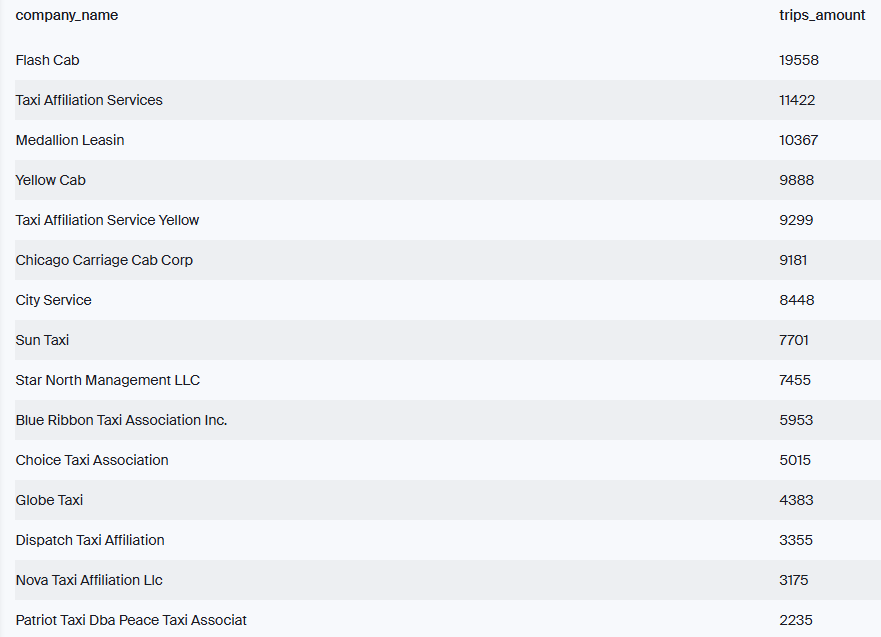
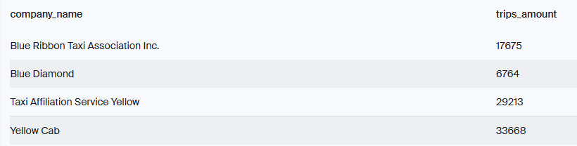
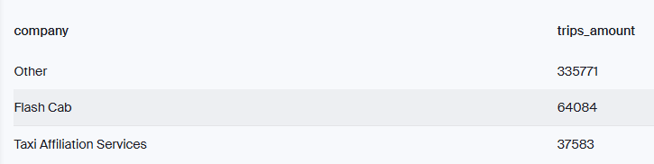
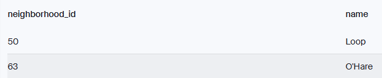
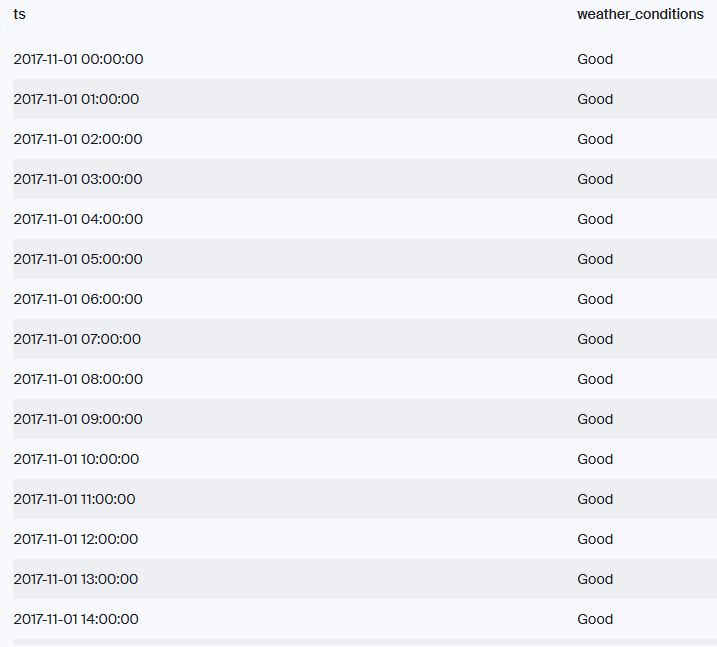
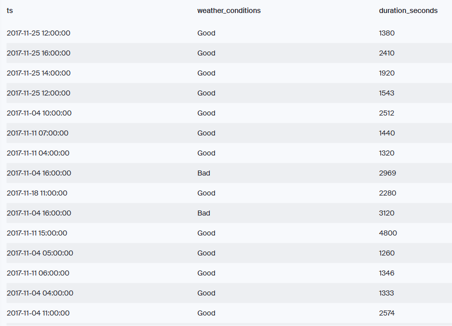

# 🚖 Chicago Taxi Ride Data Analysis – SQL

## 🚀 Overview  
This project explores Chicago taxi trip data using SQL to answer real-world business questions about company performance, ride behavior, and the impact of weather and location. Each exercise includes both SQL queries and screenshots of the output.

---

## 📊 Format  
For each exercise:
1. ✅ SQL code used to retrieve data  
2. 📸 Screenshot of the resulting output  

---

## 📂 Files Included  
- `sql/`: SQL queries used in the analysis  
- `visuals/`: Screenshots of query outputs  
- `README.md`: Project documentation  

---

## 🧠 Exercises

---

### 1️⃣ Ride Volume by Company (Nov 15–16, 2017)

#### 🔹 Objective  
Count the number of rides per company for a two-day period and sort by ride volume.

#### 🔹 SQL Code
```sql
SELECT
    cabs.company_name,
    COUNT(trips.trip_id) AS trips_amount
FROM 
    trips
    INNER JOIN cabs ON cabs.cab_id = trips.cab_id
WHERE 
    CAST(start_ts AS date) BETWEEN '2017-11-15' AND '2017-11-16' 
GROUP BY
    cabs.company_name    
ORDER BY 
    trips_amount DESC;
```


.
.
.

### 2️⃣ Rides by Companies with "Yellow" or "Blue" (Nov 1–7, 2017)

#### 🔹 Objective
Find ride volume for companies with "Yellow" or "Blue" in their name.

#### 🔹 SQL Code
```sql
SELECT
    cabs.company_name AS company_name,
    COUNT(trips.trip_id) AS trips_amount
FROM 
    trips
    INNER JOIN cabs ON cabs.cab_id = trips.cab_id
WHERE 
    CAST(start_ts AS date) BETWEEN '2017-11-01' AND '2017-11-07'
    AND cabs.company_name LIKE '%Yellow%'
GROUP BY
    company_name
UNION
SELECT
    cabs.company_name AS company_name,
    COUNT(trips.trip_id) AS trips_amount
FROM 
    trips
    INNER JOIN cabs ON cabs.cab_id = trips.cab_id
WHERE 
    CAST(start_ts AS date) BETWEEN '2017-11-01' AND '2017-11-07'
    AND cabs.company_name LIKE '%Blue%'
GROUP BY
    company_name;
```



### 3️⃣ Popular vs. Other Companies (Nov 1–7, 2017)

#### 🔹 Objective
Compare ride volume for Flash Cab and Taxi Affiliation Services vs. all other companies grouped as "Other."

#### 🔹 SQL Code
```sql
SELECT
    CASE 
        WHEN company_name = 'Flash Cab' THEN 'Flash Cab' 
        WHEN company_name = 'Taxi Affiliation Services' THEN 'Taxi Affiliation Services' 
        ELSE 'Other' 
    END AS company,
    COUNT(trips.trip_id) as trips_amount
FROM 
    cabs
INNER JOIN 
    trips 
ON 
    trips.cab_id = cabs.cab_id
WHERE 
    CAST(trips.start_ts AS date) BETWEEN '2017-11-01' AND '2017-11-07'
GROUP BY 
    company
ORDER BY 
    trips_amount DESC;
```


### 4️⃣ Retrieve O'Hare and Loop Neighborhood IDs

#### 🔹 Objective
Get neighborhood identifiers for Loop and O’Hare from the neighborhoods table.

#### 🔹 SQL Code
```sql
SELECT *
FROM 
    neighborhoods
WHERE 
    name LIKE '%Hare'
    OR name = 'Loop';
```


### 5️⃣ Categorize Weather Conditions

#### 🔹 Objective
Group hourly weather data into “Good” and “Bad” conditions based on description content.

#### 🔹 SQL Code
```sql
SELECT 
    ts,
    CASE WHEN description LIKE '%storm%' 
        OR description LIKE '%rain%' THEN 'Bad'
        ELSE 'Good' END AS weather_conditions
FROM 
    weather_records;
```


.
.
.

### 6️⃣ Saturday Rides from Loop to O’Hare + Weather

#### 🔹 Objective
Retrieve rides from the Loop to O’Hare on Saturdays with corresponding weather conditions and trip durations.

#### 🔹 SQL Code
```sql
SELECT 
    trips.start_ts AS ts,
    CASE WHEN weather_records.description LIKE '%storm%' 
        OR weather_records.description LIKE '%rain%' THEN 'Bad'
        ELSE 'Good' END AS weather_conditions,
    trips.duration_seconds AS duration_seconds
FROM 
    trips
    INNER JOIN weather_records ON weather_records.ts = trips.start_ts
WHERE 
    EXTRACT(isodow FROM trips.start_ts) = 6
    AND trips.pickup_location_id = 50
    AND trips.dropoff_location_id = 63
    AND weather_records.description IS NOT NULL
ORDER BY 
    trips.trip_id;
```


.
.
.
